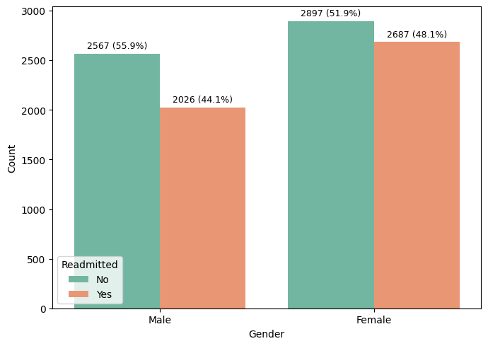
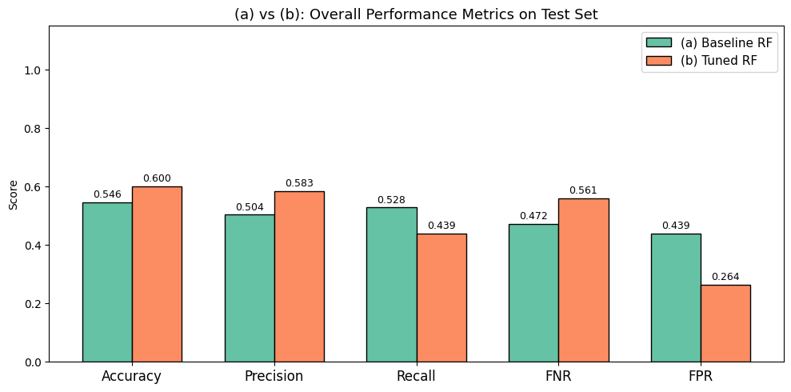
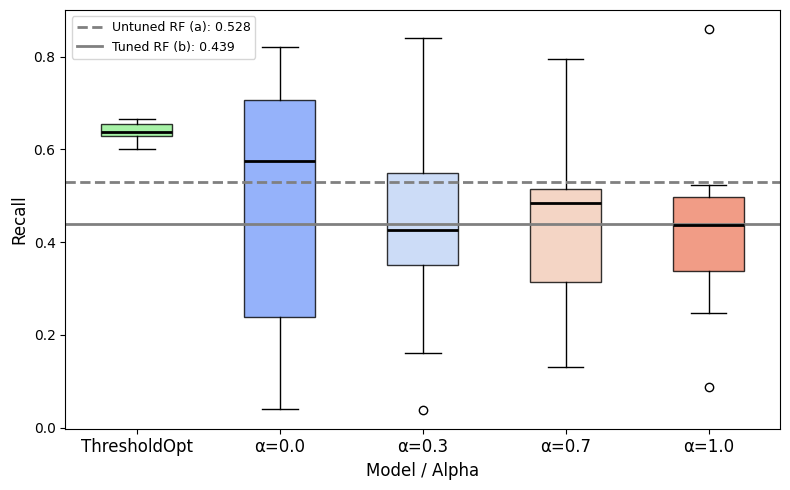
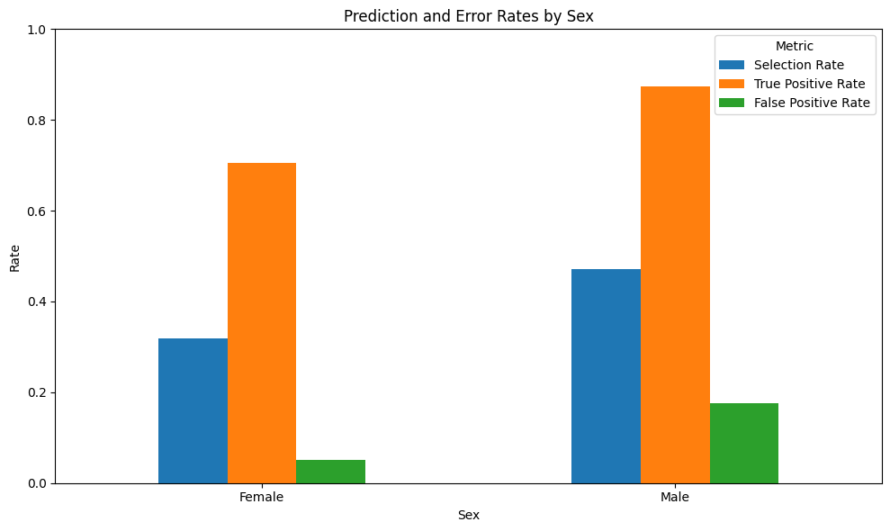
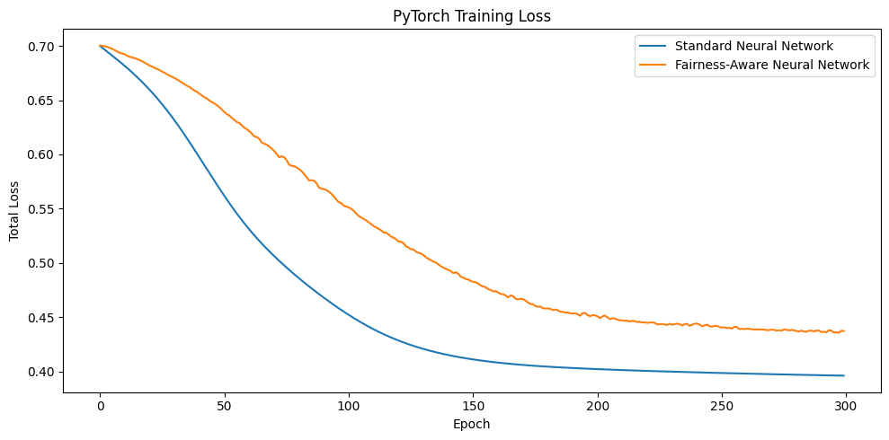

# Responsible AI

This repository collects practical experiments on **algorithmic fairness, fairness-aware learning, and mitigation strategies** in healthcare.

The two projects ask the same question from different angles:

> **How much can we reduce group disparities without losing useful predictive performance?**

---

## 1. Fairness-Aware Hospital Readmission Prediction

Using the Fairlearn **Diabetes Hospital** dataset, I compare a baseline Random Forest, a tuned Random Forest, an Adversarial Fairness Classifier, and `ThresholdOptimizer`.

  
  

The tuned Random Forest improves **accuracy from 0.546 to 0.600** and lowers FPR from **0.439 to 0.264**, but recall falls from **0.528 to 0.439**. Better aggregate performance therefore comes with more missed readmissions.

`ThresholdOptimizer` shifts the trade-off in the opposite direction: it gives **high, stable recall and lower FNR**, at the cost of more false positives.

  

➡️ [`algorithmic-fairness/`](algorithmic-fairness/)

---

## 2. Responsible & Sovereign AI: Fairness in Healthcare

A second experiment studies fairness on **16,000 healthcare records**, comparing Logistic Regression, Fairlearn post-processing, and a fairness-aware neural network.

The baseline reaches **84.8% accuracy**, but the group-level rates reveal an important gap:

  

- Female TPR: **0.706** vs Male TPR: **0.873**
- Female FPR: **0.051** vs Male FPR: **0.176**

With `ThresholdOptimizer`, DPD falls from **0.153 → 0.023** and EOD from **0.167 → 0.016**, while accuracy rises to **0.863** on this split.

The fairness-aware neural network goes further on parity, but changes the optimization objective and pays a performance cost.

  

Its DPD falls from **0.157 → 0.002** and EOD from **0.171 → 0.019**, while accuracy decreases from **0.848 → 0.822**.

➡️ [`responsible-sovereign-ai/`](responsible-sovereign-ai/)

---

## What these experiments show

Across both projects, the main pattern is consistent:

- **higher accuracy does not automatically mean greater fairness;**
- fairness interventions redistribute errors differently;
- post-processing can sometimes deliver large fairness gains with little performance loss;
- in-processing can achieve stronger parity, but may impose a clearer accuracy/recall cost.

The practical question is therefore not simply **“fairness or performance?”**, but **which trade-off is appropriate for the application and the errors that matter most?**

---

`Python` · `scikit-learn` · `Fairlearn` · `PyTorch` · `pandas` · `Matplotlib` · `Seaborn`
