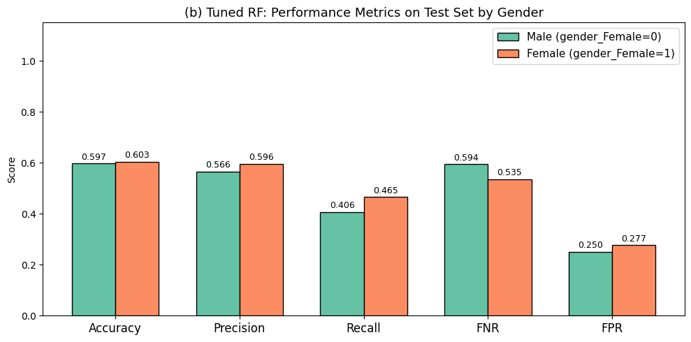
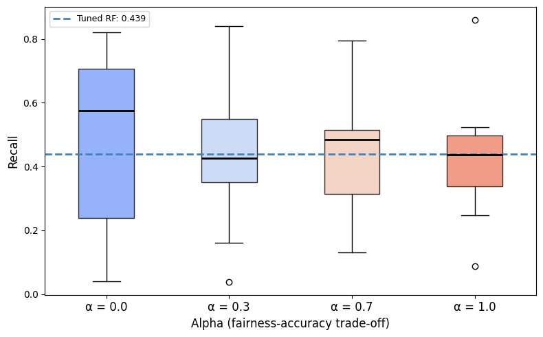
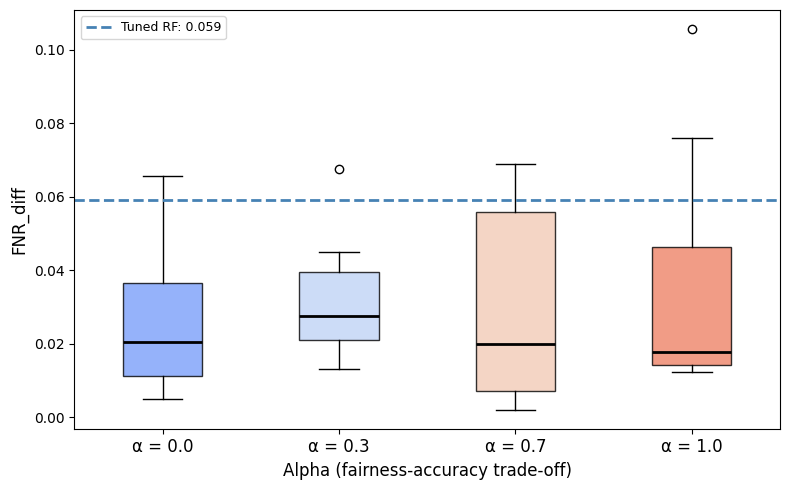
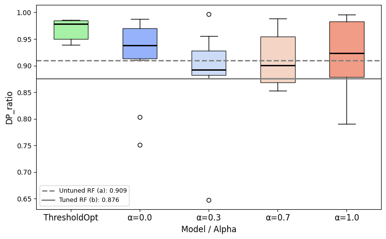

# Fairness-Aware Hospital Readmission Prediction

This project explores how **predictive performance and algorithmic fairness change under different fairness interventions** for hospital readmission prediction.

Using the Fairlearn **Diabetes Hospital** dataset, I compare:

- a baseline Random Forest;
- a hyperparameter-tuned Random Forest;
- an Adversarial Fairness Classifier;
- ThresholdOptimizer with an Equalized Odds constraint.

`gender` is used as the sensitive attribute.

## Dataset

The outcome is hospital readmission. Readmission rates are fairly close across the two recorded gender groups, although females have a slightly higher positive rate.

<p align="center">
  
</p>

- Male readmission rate: **44.1%**
- Female readmission rate: **48.1%**

## Baseline vs tuned Random Forest

The baseline uses a single tree. The tuned model uses `n_estimators=1000` and `max_depth=10`.

<p align="center">
  
</p>

Tuning improves **accuracy from 0.546 to 0.600** and **precision from 0.504 to 0.583**. It also reduces FPR from **0.439 to 0.264**.

The gain comes with a clear cost: recall falls from **0.528 to 0.439**, so FNR increases from **0.472 to 0.561**. The tuned model is more conservative and misses more true readmissions.

### Performance by gender

<p align="center">
  
</p>

After tuning, females have higher accuracy, precision, and recall, while males have the lower FPR. The FNR difference increases from **0.040 to 0.059**, whereas the FPR difference decreases from **0.046 to 0.027**.

This shows that improving aggregate performance does not automatically improve every fairness criterion.

## Adversarial fairness

The Adversarial Fairness Classifier is evaluated for:

```text
alpha = 0.0, 0.3, 0.7, 1.0
```

across multiple random seeds.

### Recall

<p align="center">
  
</p>

The adversarial models generally achieve **higher recall than the tuned Random Forest**, but with lower accuracy and precision.

### FNR disparity

<p align="center">
  
</p>

The intervention reduces FNR disparities in several configurations, although the effect is not monotonic across `alpha`. Fairness improvement therefore depends on both the metric and the strength of the adversarial objective.

## ThresholdOptimizer

Finally, I apply Fairlearn's `ThresholdOptimizer` to the tuned Random Forest using an **Equalized Odds** constraint.

### Recall comparison

<p align="center">
  
</p>

ThresholdOptimizer gives high and relatively stable recall across data splits, reducing the number of missed readmissions compared with the tuned Random Forest.

### Demographic parity

<p align="center">
  
</p>

The post-processing intervention also produces strong and stable demographic-parity behavior. Its main cost is a higher false-positive rate.

## Main takeaway

There is no single model that dominates every metric.

- **Tuned Random Forest:** better accuracy and precision, but more missed readmissions.
- **Adversarial Fairness:** improves recall and some group disparities, with lower predictive performance.
- **ThresholdOptimizer:** strong recall and stable fairness, but more false positives.

For this experiment, the main trade-off is therefore between **missing high-risk patients** and **raising additional false alarms**.

## Tools

- Python
- scikit-learn
- Fairlearn
- pandas
- NumPy
- Matplotlib
- Seaborn

## Notebook

The complete analysis is available in:

```text
fairness_interventions_diabetes_hospital_concise.ipynb
```

## Note

This is a technical fairness analysis on the recorded gender categories in the dataset. It is not a clinical validation study or a claim that any of the evaluated models is ready for deployment.
