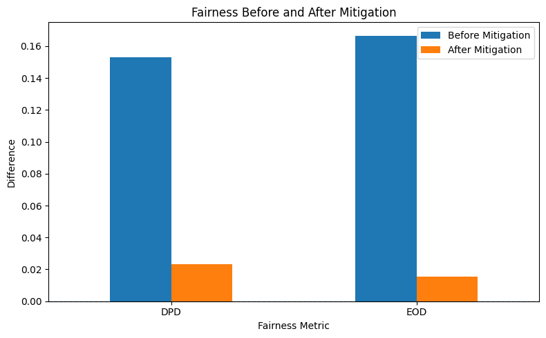
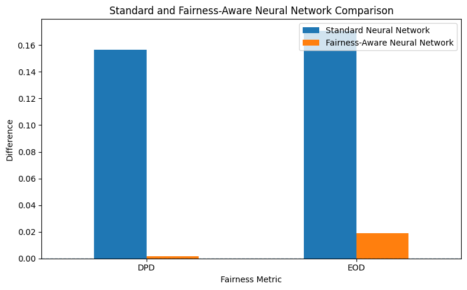

# Responsible & Sovereign AI: Fairness in Healthcare

> **A model can look accurate overall and still behave very differently across groups.**

This notebook explores that gap on **16,000 healthcare records**. I compare three strategies:

**Logistic Regression → Fairlearn ThresholdOptimizer → Fairness-aware Neural Network**

`Sex` is used only for fairness auditing, not as a predictive feature.

---

## 1. A strong baseline — with an important hidden gap

The baseline Logistic Regression reaches:

| Accuracy | Precision | Recall | F1 |
|---:|---:|---:|---:|
| **0.848** | 0.837 | 0.786 | 0.811 |

At first glance, this looks solid. But group-level behavior tells a different story.

  

| Rate | Female | Male |
|---|---:|---:|
| Selection rate | 0.318 | **0.471** |
| True positive rate | 0.706 | **0.873** |
| False positive rate | 0.051 | **0.176** |

The model detects positives much more often for males, while also producing many more false positives.

**Baseline fairness**
- DPD = **0.153**
- EOD = **0.167**

---

## 2. Post-processing: small intervention, large effect

I apply Fairlearn's `ThresholdOptimizer` with an **Equalized Odds** constraint.

Only **204 of 3,200 test predictions** are changed.

| Metric | Baseline | ThresholdOptimizer |
|---|---:|---:|
| Accuracy | 0.848 | **0.863** |
| Precision | 0.837 | **0.869** |
| Recall | 0.786 | 0.787 |
| F1 | 0.811 | **0.826** |
| DPD ↓ | 0.153 | **0.023** |
| EOD ↓ | 0.167 | **0.016** |

  

After mitigation, the group rates become much closer:

- TPR: **0.783 vs 0.791**
- FPR: **0.077 vs 0.092**
- Selection rate: **0.365 vs 0.388**

In this split, post-processing reduces disparity **without sacrificing predictive performance**.

---

## 3. Fairness during training

The second intervention changes the learning objective itself:

\[
L = L_{\text{classification}} + \lambda L_{\text{fairness}}
\]

The fairness-aware network therefore does not optimize prediction loss alone.

  

The higher final total loss is expected: the fairness-aware model is optimizing an additional constraint, so its curve is not directly comparable to the standard network as pure classification loss.

What matters is what that extra objective buys:

| Model | Accuracy | Recall | DPD ↓ | EOD ↓ |
|---|---:|---:|---:|---:|
| Standard NN | **0.848** | **0.784** | 0.157 | 0.171 |
| Fairness-aware NN | 0.822 | 0.749 | **0.002** | **0.019** |

  

The fairness-aware network almost eliminates demographic-parity difference, but loses about **2.6 percentage points of accuracy** and **3.5 points of recall**.

---

## Main result

The interesting part is not simply that fairness improved. It is that the two interventions achieved it in very different ways:

- **ThresholdOptimizer:** DPD **0.153 → 0.023**, EOD **0.167 → 0.016**, with slightly better accuracy.
- **Fairness-aware NN:** DPD **0.157 → 0.002**, EOD **0.171 → 0.019**, but with lower accuracy and recall.

So the real question is not **“accuracy or fairness?”**

It is:

> **Which fairness intervention gives the trade-off that makes sense for the application?**

---

## Stack

`Python` · `scikit-learn` · `Fairlearn` · `PyTorch` · `pandas` · `Matplotlib`

## Notebook

[`Responsible_and_Sovereign_AI_Tutorial_refined.ipynb`](Responsible_and_Sovereign_AI_Tutorial_refined.ipynb)

> This is a technical fairness analysis on the protected groups recorded in the dataset, not a clinical deployment recommendation.
